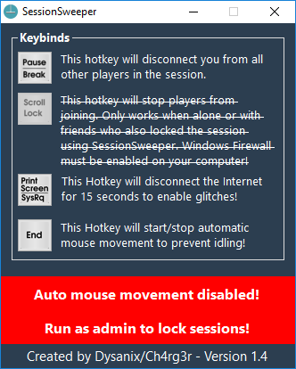

**Working on SessionSweeper 2**

**GTA V Online - SessionSweeper 1.4** 
Press *Pause/Break* to disconnect from everyone in your current session and be alone. 
Press *Scroll Lock* to toggle lock your current session and stop people from joining. 
Press *Print Screen* to disconnect and reconnect internet. 
Press *End* to Enable/Disable anti idle. 
 
 
 
 
**Official Threads: 
[Reddit](https://www.reddit.com/r/gtaonline/comments/69kib3/program_to_empty_your_session_and_prevent_people/) | [Hackforums](https://hackforums.net/showthread.php?tid=5616391) | [MPGH](http://www.mpgh.net/forum/showthread.php?t=1256022)** 
 
**Requirements for Session Locking:** 
[1] Windows Firewall needs to be enabled. 
[2] You need to run SessionSweeper as Administrator, so it can edit Firewall rules. 
[3] Everyone in your session needs to have SessionSweeper's session lock enabled to work if you are not alone. 
 
**Will I get banned for using this?** 
**No,** process suspension and firewall blockage can happen on any normal computer. 
 
**Video:** 
 
 
**Image:** 

